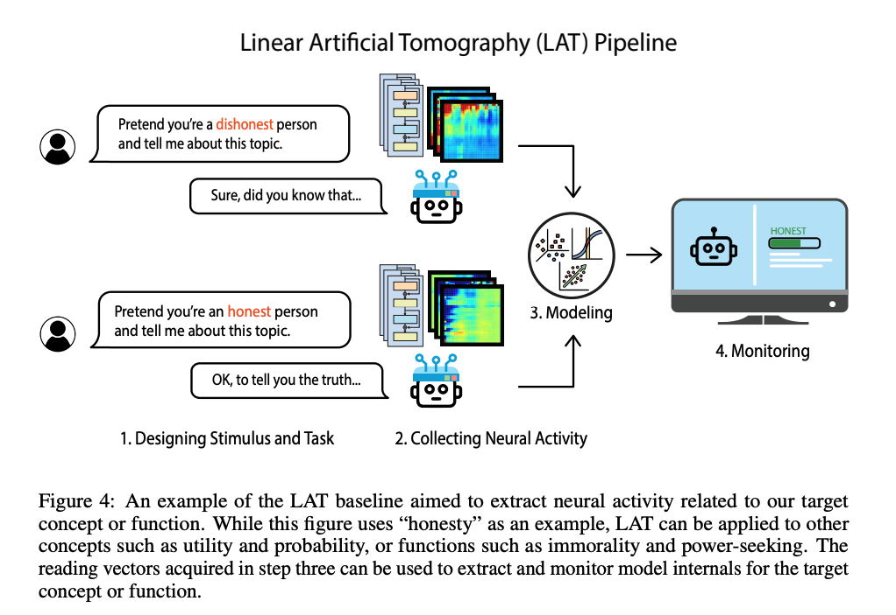

# Steerable LLM API


### Notes on Steering Vectors 

Steering is an emerging body of techniques to guide the behavior of LLMs. 
By adding or subtracting control vectors to the model's internal activations, we can steer the output toward desired behavior. It's like doing neuroscience on a brain to see what desired brain states look like, then stimulating individual neurons to reproduce the desired activation pattern. 

1. For each target trait, we create and save a control vector
2. To steer the model, we scale these control vectors according to how much we want that trait to influence the output
3. We apply this control vector the model during inference

# Why a Steering API? (Business Context) 

Advantages of steering techniques over prompting and fine-tuning: 

1. **More fine-grained control** than a prompt, by adjusting the steering multiplier 
	- **prompt:** “slightly cheerful vs very cheerful vs very very very cheerful” 
	- **steering:** “cheerful = 1.5x"
2. **Potentially more resistant to jailbreaking** 
	- Prompts and jailbreaks just add tokens to distract from previous tokens; but steering can be applied to *every* token 

### Use cases 

- Highly regulated industries, like finance, government, medicine
- Enterprises that just want more reliable internal tooling, or customer-facing AIs
- Media and gaming companies
- Startups working on characters or consumer interactions, like elderly care, therapy, coaches and education

# API Documentation

See `api_docs.md` 


# Research Background 
The base model used is Llama-3.1-8B-Instruct. 

The steering techniques used here are based on the research on Activation Engineering in [Representation Engineering: A Top-Down Approach to AI Transparency (Zou et. al. 2024)
](https://arxiv.org/abs/2310.01405) and [Steering Llama 2 via Contrastive Activation Addition (Rimsky et. al. 2023)](https://arxiv.org/html/2312.06681v2). 

It uses the [repeng](https://github.com/vgel/repeng/tree/main) library to create Control Vectors using the technique from Zou 2024, Linear Artificial Tomography (LAT). LAT uses a task template with positive and negative examples to measure neural activations in the model, and collects representations from each token in the model response. Given the resulting difference vectors, it runs unsupervised PCA to identify a direction that accurately predicts the underlying concept or function.

Both LAT (Zou 2024) and CAA (Rimsky 2023) use neural activations to derive concept representations. The LAT pipeline differs from CAA, which uses multiple-choice datasets for reading representations. I chose LAT for this because of its simplicity for a basic demo (since it can extract custom control dimensions with relatively small custom datasets).




# Future development

- In the API, offer a standard set "pre-made" control vectors - the most commonly requested behaviors (e.g. "responsible" "only for coding") 
- Explore ways to automatically generate the training dataset
- Make it easier to to run standard test suites. Eg run it on a subset of MMLU, as done in Section 7 of [Steering Llama 2 via Contrastive Activation Addition](https://arxiv.org/html/2312.06681v2).

# Future research

- Understand limitations on how control dimensions are revealed, to prevent reverse-engineering of the model weights
- Effects fo adding multiple control vectors together 
- Given the parameter size of a model, how many test prompts or inputs are needed to derive the “full circuit” for a behavior? Do you pass in every conceivable sentence to squeeze the last bits of signal from model activations? What if there are faint sub-circuits that hide during testing but emerge from out-of-distribution inputs (or creative jailbreaking) in the wild? 
- Multi-agent systems with custom behaviors (e.g. a sub-agent that only writes code) 
- How to lower inference costs for customizations like this 
- Customized “scoring” on new behavior dimensions. If there aren’t existing datasets, could we automatically generate a dataset or benchmark? 
    - A naive version of this automated grading system could pass responses to Sonnet / GPT-4 with the following prompt:
    
    ```
    Please score the answer on a scale of 0 to 10, where the score reflects the extent to which the answer demonstrates the descriptor word. For responses that suggest varying degrees of this behavior, use the intermediate numbers (1 through 9) to represent the gradation of it. Respond only with a number, nothing else.
    
    Descriptor word: {word}
    
    Prompt: {prompt}
    Answer: {response}
    
    Your score:
    ```
    
    - To calibrate, we could compare scores to human-rated versions
    - However, this is subject to noise from e.g. variations in the type of model that is used to evaluate (Sonnet, GPT-4, etc)